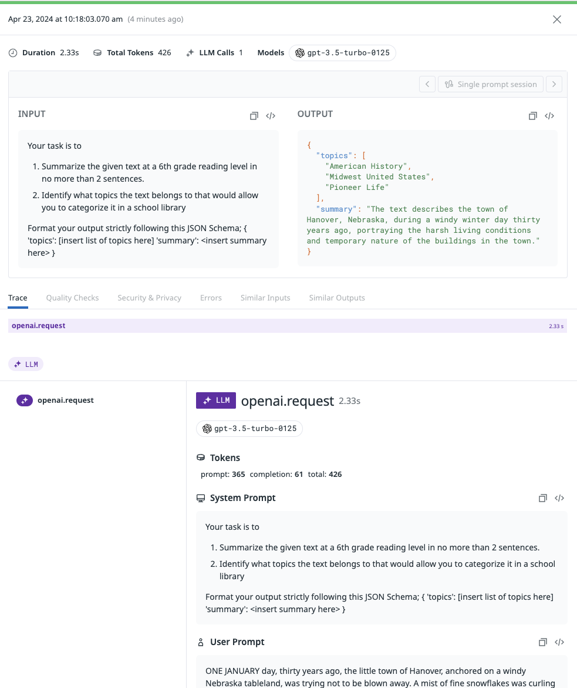
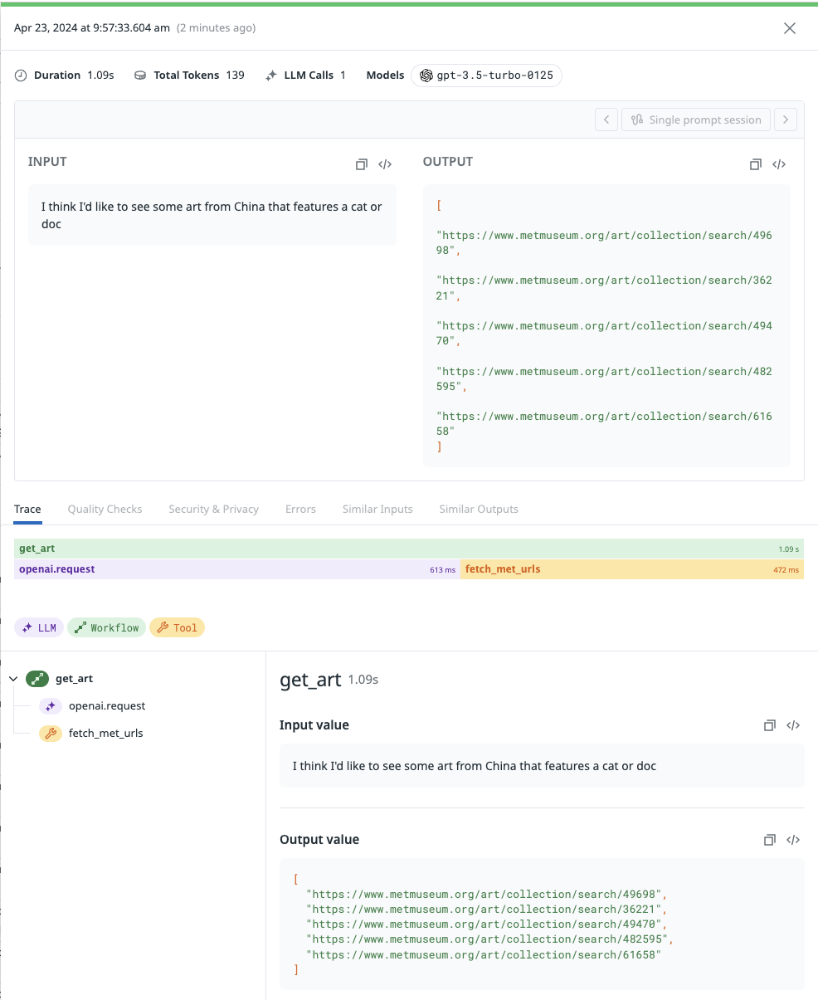

# llm-observability interactive onboarding

## Setup

#### 1. Activate your virtualenv:

```bash
python -m venv env
source env/bin/activate
```

#### 2. Install dependencies in the requirements.txt file:

`pip install -r requirements.txt`

#### 3. Create a .env file and add the following:

```bash
DD_LLMOBS_ENABLED=1
DD_LLMOBS_NO_APM=1
DD_LLMOBS_APP_NAME=test-onboarding-app
DD_API_KEY=<your API key goes here>
```

#### 4. Launch Jupyter notebooks
You can either start Jupyter on the command line (`jupyter notebook`) to use the web interface, or open your notebook from your prefered code editor (e.g. VSCode) and run it there.

## Notebooks

### 1. Tracing a simple LLM call

**[This notebook](./1-llm-span.ipynb)** shows you how to create and trace a simple LLM call.

 

### 2. Tracing an LLM Workflow

**[This notebook](./2-workflow-span.ipynb)** shows you how to create and trace a more complex, static series of steps that involves a tool call as well as a call to an LLM.

 

### 3. Tracing an an LLM Agent

_coming soon_

## Teardown

When you're done with the tutorials, deactivate your virtualenv and return to your system's default Python env:

```
deactivate
```
