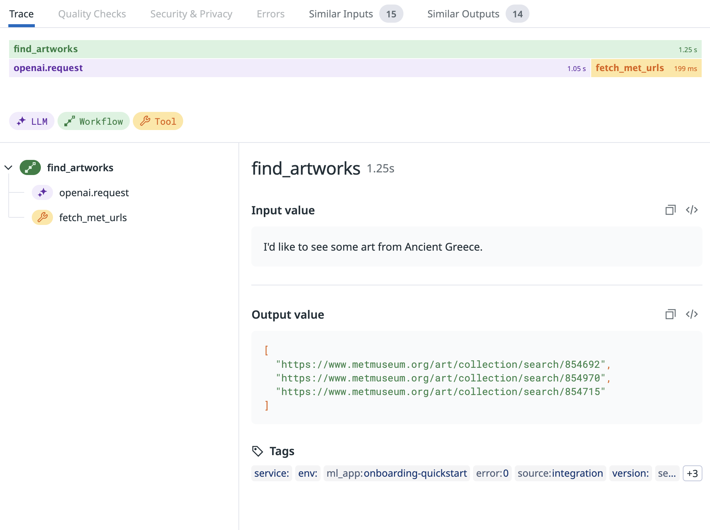

# LLM Observability Jupyter Notebooks

This collection of notebooks exists for engineers who would like to learn by example how to instrument Datadog's LLM Observability product.

## Setup

#### 1. Activate your virtualenv:

```bash
python -m venv myenv
source myenv/bin/activate
```

#### 2. Create a .env file and add the following:

```bash
DD_API_KEY=<your API key goes here>
DD_SITE=<your site goes here if necessary -- the default is "datadoghq.com">
```

#### 3. If you don't already have a system-wide OPENAI_API_KEY variable, add one to the .env file:

```bash
OPENAI_API_KEY=<your API key goes here>
```

#### 3. Install shared dependencies from the requirements.txt file:

```bash
pip install -r requirements.txt
```

#### 4. Launch Jupyter notebooks
You can either start Jupyter on the command line (`jupyter notebook`) to use the web interface, or open your notebook from your prefered code editor (e.g. VSCode) and run it there.

## Notebooks

### 1. Tracing a simple LLM call

**[This notebook](./1-llm-span.ipynb)** shows you how to create and trace a simple LLM call.

 

### 2. Tracing an LLM Workflow

**[This notebook](./2-workflow-span.ipynb)** shows you how to create and trace a more complex, static series of steps that involves a tool call as well as a call to an LLM.

 

### 3. Tracing an an LLM Agent

**[This notebook](./3-agent-span.ipynb)** shows you how to create and trace an LLM powered agent that calls tools and makes decisions based on data about what to do next.

 

## Teardown

When you're done with the tutorials, deactivate your virtualenv and return to your system's default Python env:

```bash
deactivate
```

