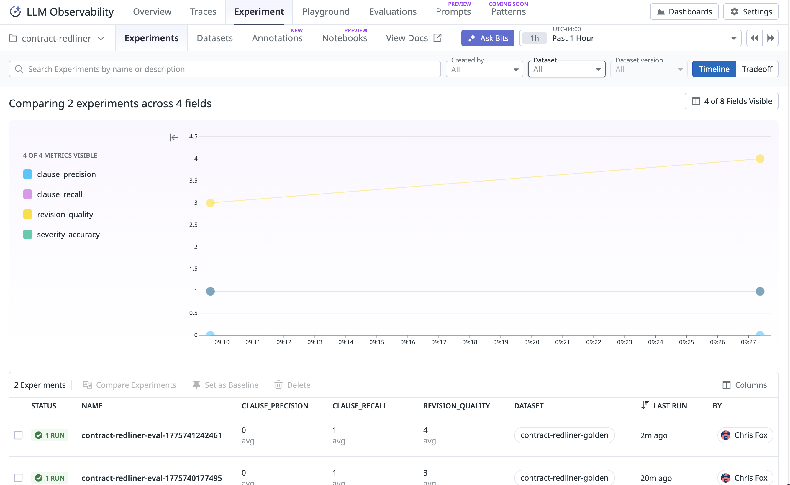
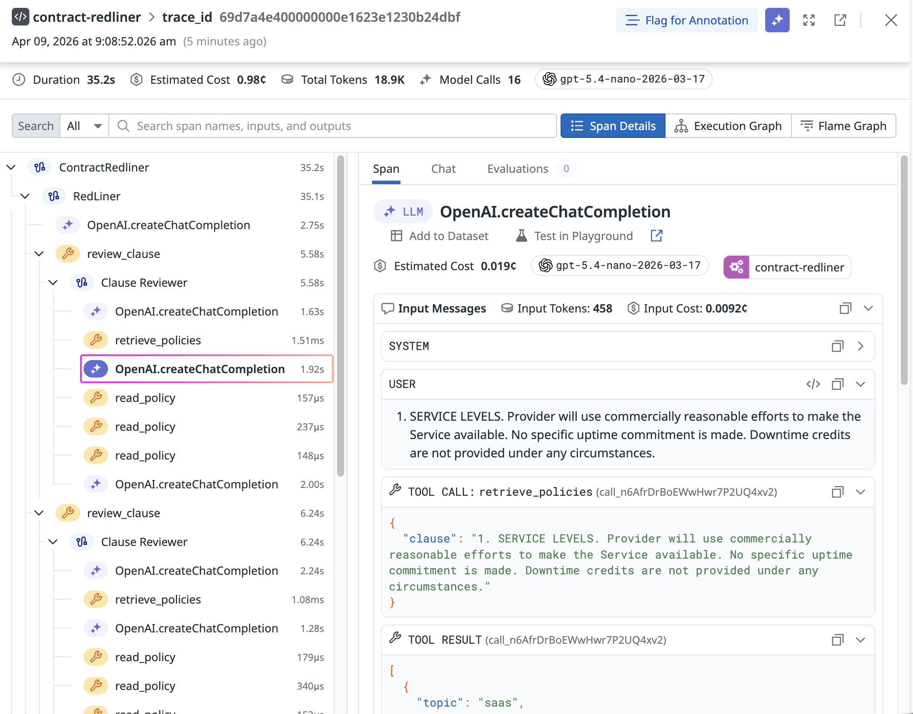

# Contract Redliner

An AI-powered contract review agent that automates legal due diligence by analyzing contracts against company policies, identifying risk areas, and proposing specific clause revisions. Built with Pydantic AI and traced end-to-end with Datadog LLM Observability.

## Quickstart

**1. Set up Python environment**

```bash
cd contract-redliner/

# Create a virtual environment
python3 -m venv .venv

# Activate the virtual environment
source .venv/bin/activate

# Install dependencies
pip install ddtrace "pydantic-ai-slim[openai]"
```

**2. Configure environment variables**

Set these env vars:
```bash
export DD_API_KEY=your_datadog_api_key_here
export DD_APP_KEY=your_datadog_app_key_here
export OPENAI_API_KEY=your_openai_api_key_here
```

If you need to use a different value for `DD_SITE` than the 
default `datadoghq.com`, also set:

```bash
export DD_SITE=your_datadog_site
```


**3. Run the agent**

```bash
python main.py
```

The example script (`main.py`) runs the agent on a sample SaaS contract with intentionally problematic clauses. 
All agent actions, LLM calls, and tool invocations are automatically traced in Datadog LLM Observability for debugging and performance analysis.  
Note: the agent can take up to 30s to complete the task.

### Example output

After running `python main.py`, the agent returns a structured JSON object:

```json
original_clause='1. SERVICE LEVELS. Provider will use commercially reasonable efforts to make the Service available. No specific uptime commitment is made. Downtime credits are not provided under any circumstances.'

revision={
  "reasoning": "Clause disclaims any uptime commitment and provides no downtime credits, which conflicts with policy requiring a 99.5% monthly uptime SLA and defined downtime credits. Revise to include minimum uptime and credits while keeping language largely similar and not materially longer.",
  "revised_clause": "1. SERVICE LEVELS. Provider will use commercially reasonable efforts to make the Service available. Provider shall meet a minimum 99.5% monthly uptime SLA, measured on a monthly basis. If Provider fails to meet the SLA, Customer will receive downtime credits of at least 10% of the applicable monthly service fees for each full hour (or pro-rated, where applicable) of excess downtime during the month in which the SLA is not met.",
  "risk_level": "high"
}

...[additional revisions]
```

## Offline evaluation

**Run the evaluation**:

```bash
python experiment.py
```

This executes the agent on 20 labeled test contracts from `golden_dataset.csv`, measuring performance across four dimensions:

1. **clause_recall**: Percentage of risky clauses correctly identified

2. **clause_precision**: Percentage of flagged clauses that are actually problematic

3. **severity_accuracy**: Accuracy of the agent's risk classification when it correctly flagged a clause

4. **revision_quality**: Average rating by an LLM judge of the agent's suggested revision relative to the ground truth revision (1-5 scale), when the agent correctly flagged a clause

**Results & iteration**: On the LLM Observability Experiments Page, you can
track performance, cost, and latency across experiment runs.


**Ideas to test in offline evaluation**:

1. Upgrade the model
2. Adjust the Clause Reviewer agent prompt based on observed errors
3. Add a 3rd Final Reviewer agent to review all the revisions for overall consistency and a final check
4. Extend policies with examples of good and bad clauses

Use the Datadog UI to drill into individual traces where recall or precision failed, inspect the agent's tool calls, and understand *why* it missed a clause or over-flagged safe language. Compare experiments side-by-side to validate which changes actually moved the metrics.

## Observability

All execution is automatically traced in Datadog LLM Observability.


