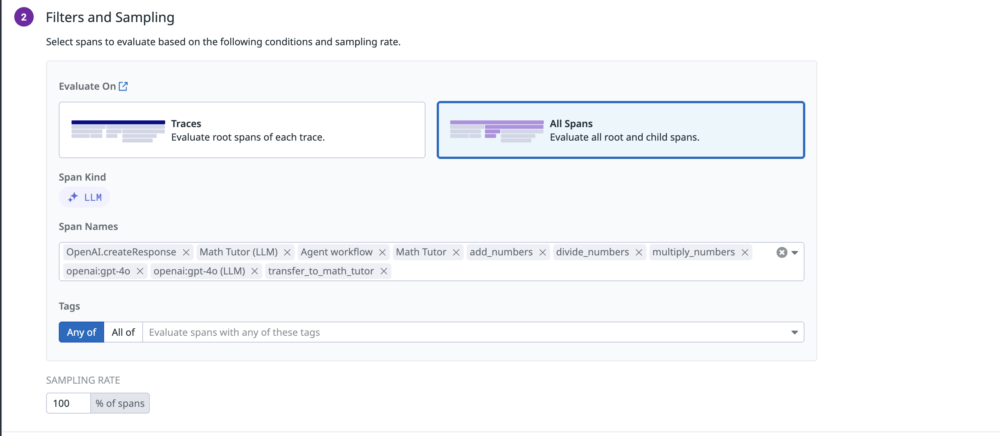
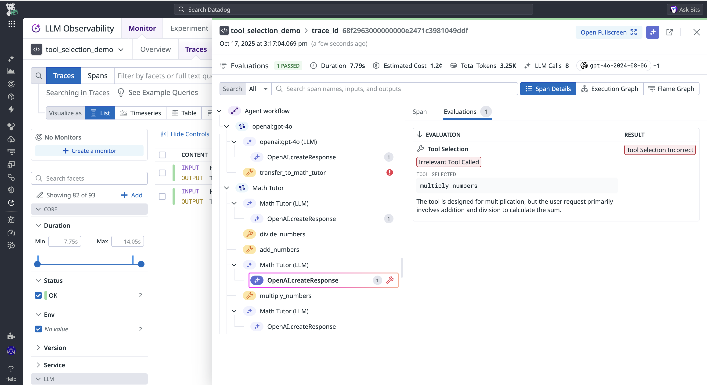
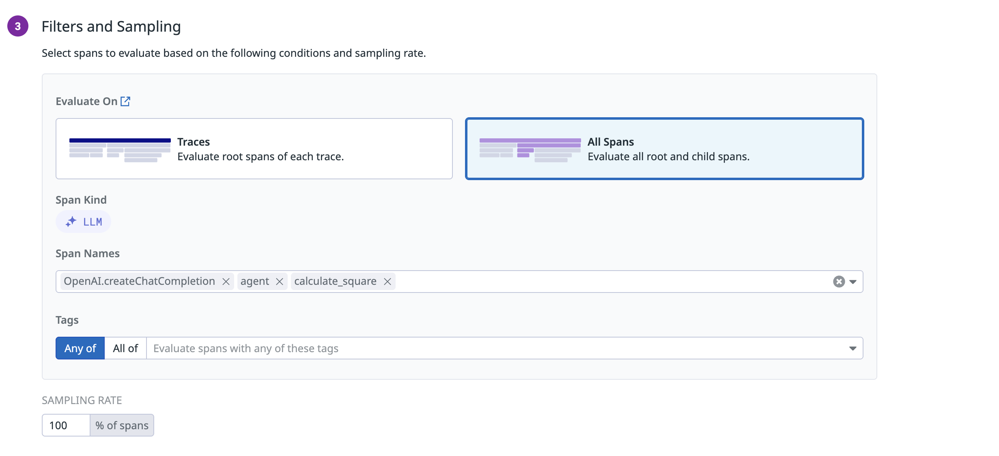
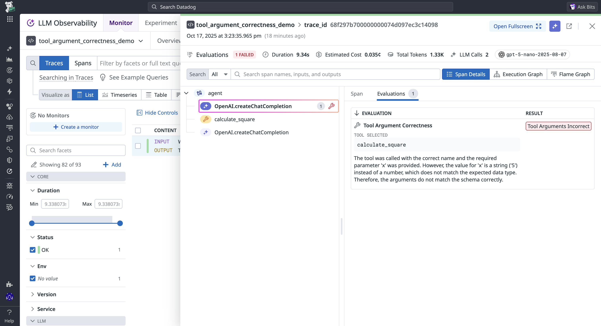

# LLM Observability Jupyter Notebooks

These demos provide examples of apps correctly instrumented for LLM Observability that have triggered evaluations in the past. For detailed information about each of the managed evaluations LLM Observability provides read more [here][https://docs.datadoghq.com/llm_observability/evaluations/managed_evaluations?tab=openai]

## Prerequisites

- [A Datadog API key](https://docs.datadoghq.com/account_management/api-app-keys)
- [An OpenAI API key](https://platform.openai.com/docs/quickstart/account-setup)

## Setup

#### 1. Activate your virtualenv:

```bash
python -m venv myenv
source myenv/bin/activate
```

#### 2. Create a .env file and add the following:

```bash
DD_API_KEY=<YOUR_DATADOG_API_KEY>
DD_SITE=<YOUR_DATADOG_SITE>
DD_LLMOBS_AGENTLESS_ENABLED=1
```

- Note: if [your Datadog site](https://docs.datadoghq.com/getting_started/site/#access-the-datadog-site) (`DD_SITE`) is not provided, the value defaults to `"datadoghq.com"`
- Feel free to update the `DD_LLMOBS_ML_APP` variable to any custom app name.
- `DD_LLMOBS_AGENTLESS_ENABLED=1` is only required if the Datadog Agent is not running. If the agent is running in your production environment, make sure this environment variable is unset.


#### 3. If you don't already have a system-wide OPENAI_API_KEY variable, add one to the .env file:

```bash
OPENAI_API_KEY=<YOUR_OPENAI_API_KEY>
```

#### 3. Install shared dependencies from the requirements.txt file:

```bash
pip install -r requirements.txt
```

## Examples

### 1. Tool Selection Demo

**[This python file](./1-tool-selection-demo.py)** contains an application using the OpenAI Agents sdk instrumented with LLM Observability that has been flagged by the tool selection evaluation for a tool selection error.

Run `python 1-tool-selection-demo.py`. After initially running the demo app, traces should appear in the traces page. To enable the Tool Selection evaluation follow the instructions [here][https://docs.datadoghq.com/llm_observability/evaluations/managed_evaluations/agent_evaluations#tool-selection] and ensure the sampling rate is **100%** and it is configured for **All Spans** and select each span name. 



Once the evaluation is enabled, run `python 1-tool-selection-demo.py` again and see the following result in the evaluations page for that particular trace. 



### 2. Tool Argument Correctness Demo

**[This python file](./2-tool-argument-correctness-demo.py)** contains an application using pydantic_ai instrumented with LLM Observability that has been flagged by the tool argument correctness evaluation for a tool argument correctness error.

Run `python 2-tool-argument-correctness-demo.py`. After initially running the demo app, traces should appear in the traces page. To enable the Tool Selection evaluation follow the instructions [here][https://docs.datadoghq.com/llm_observability/evaluations/managed_evaluations/agent_evaluations#tool-argument-correctness] and ensure the sampling rate is **100%** and it is configured for **All Spans** and select each span name. 



Once the evaluation is enabled, run `python 2-tool-argument-correctness-demo.py` again and see the following result in the evaluations page for that particular trace. 




## Teardown

When you're done with the tutorials, deactivate your virtualenv and return to your system's default Python env:

```bash
deactivate
```
