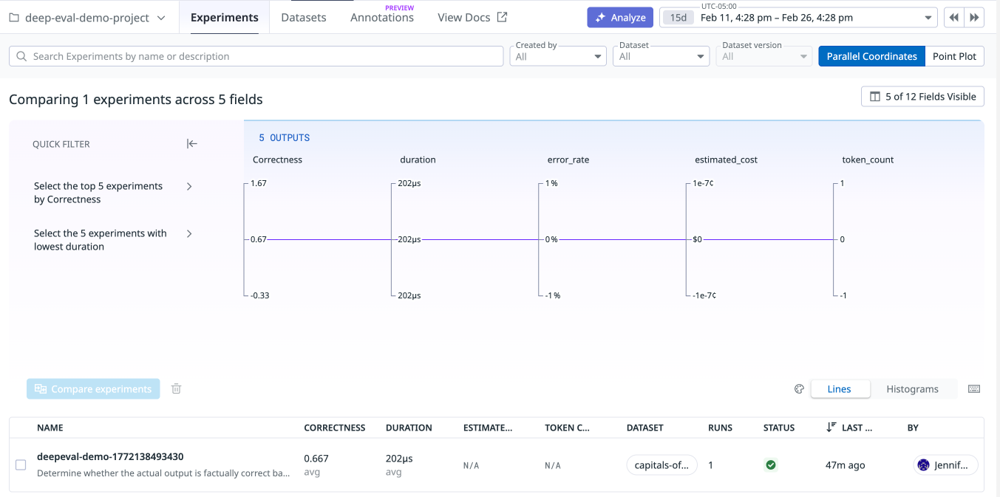
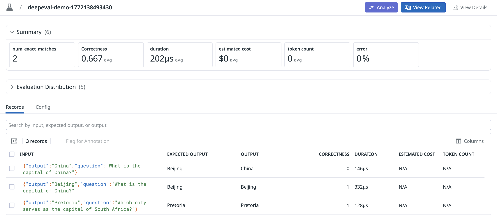

# LLM Observability Jupyter Notebooks

These demos provide examples of evaluation frameworks that are integrated into LLM Observability Experiments. For more information about using DeepEval evaluations with LLM Observability  Experiments read more [here](https://docs.datadoghq.com/llm_observability/evaluations/deepeval_evaluations/).

## Prerequisites

- [A Datadog API key](https://docs.datadoghq.com/account_management/api-app-keys)
- [An OpenAI API key](https://platform.openai.com/docs/quickstart/account-setup)

## Setup

#### 1. Activate your virtualenv:

```bash
python -m venv myenv
source myenv/bin/activate
```

#### 2. Create a .env file and add the following:

```bash
DD_API_KEY=<YOUR_DATADOG_API_KEY>
DD_SITE=<YOUR_DATADOG_SITE>
DD_LLMOBS_AGENTLESS_ENABLED=1
```

- Note: if [your Datadog site](https://docs.datadoghq.com/getting_started/site/#access-the-datadog-site) (`DD_SITE`) is not provided, the value defaults to `"datadoghq.com"`
- `DD_LLMOBS_AGENTLESS_ENABLED=1` is only required if the Datadog Agent is not running. If the agent is running in your production environment, make sure this environment variable is unset.


#### 3. If you don't already have a system-wide OPENAI_API_KEY variable, add one to the .env file:

```bash
OPENAI_API_KEY=<YOUR_OPENAI_API_KEY>
```

#### 3. Install shared dependencies from the requirements.txt file:

```bash
pip install -r requirements.txt
```

## Examples

### 1. DeepEval Demo

**[This python file](./1-deepeval-demo.py)** contains an LLMObs experiment using a DeepEval evaluator.

Run `python 1-tdeepeval-demo.py`. After running the experiment, the experiment's results should appear under the project name in the experiments page.



Clicking on the experiment allows you to view the evaluation result(s) per record in the dataset.




## Teardown

When you're done with the tutorials, deactivate your virtualenv and return to your system's default Python env:

```bash
deactivate
```